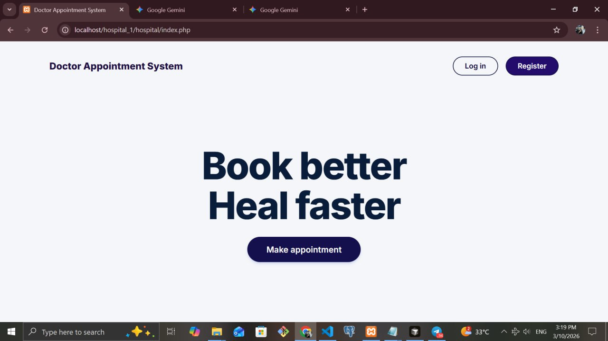
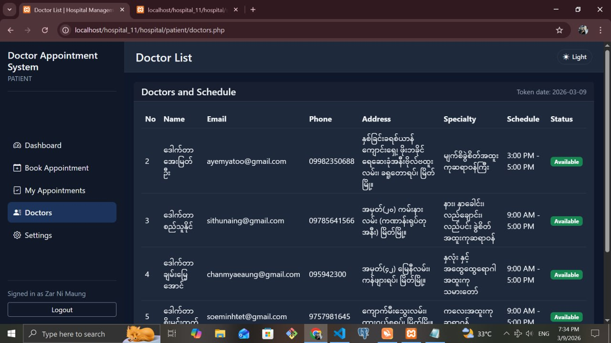
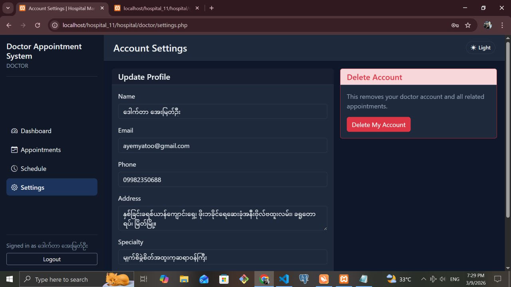
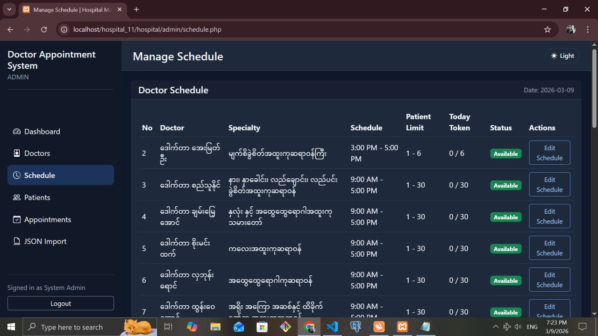
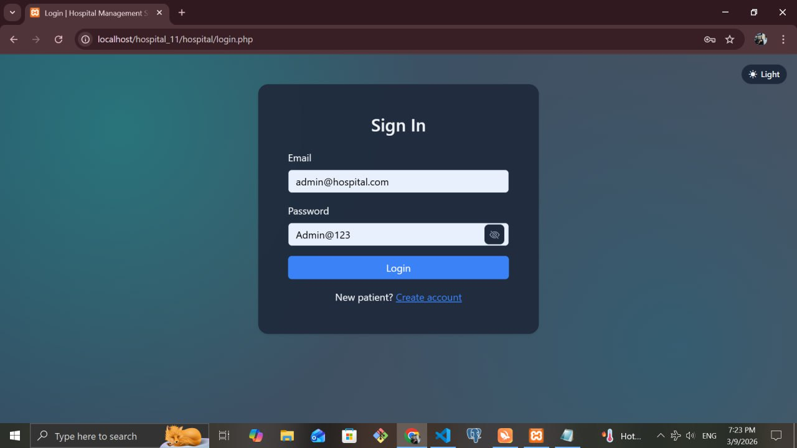
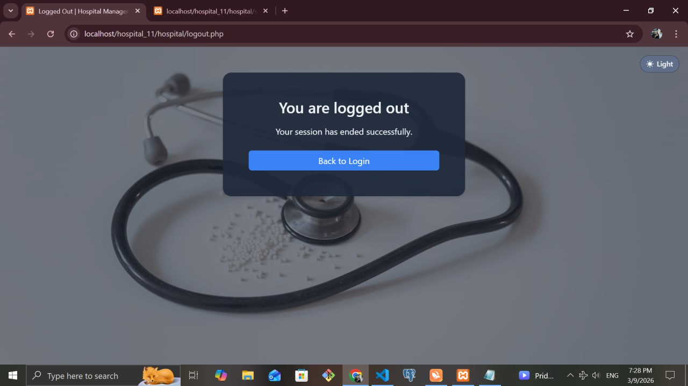

# 🏥 Doctor Appointment System

ဒီ Project ကတော့ လူနာများနှင့် ဆရာဝန်များအကြား ဆေးခန်းပြသရန် ရက်ချိန်း (Appointment) များကို အလွယ်တကူ ရယူ၊ စီမံနိုင်ရန် ရေးသားထားသော ဝဘ်အပလီကေးရှင်း (Web Application) တစ်ခု ဖြစ်ပါသည်။ 

UI/UX ပိုင်းကို သေသပ်လှပပြီး အသုံးပြုရလွယ်ကူအောင် (Responsive ဖြစ်အောင်) Layout များကို စနစ်တကျ ပုံစံချ ပြင်ဆင်ထားပါသည်။

---

## ✨ Features (လုပ်ဆောင်ချက်များ)

* **🔐 Authentication:** လူနာများနှင့် ဆရာဝန်များအတွက် သီးသန့် Login / Register ပြုလုပ်နိုင်ခြင်း။
* **📅 Appointment Scheduling:** မိမိပြသလိုသော ဆရာဝန်၊ နေ့ရက်နှင့် အချိန်ကို ရွေးချယ်၍ ရက်ချိန်းရယူနိုင်ခြင်း။
* **📊 Dashboard:** * **လူနာ:** မိမိရယူထားသော ရက်ချိန်းမှတ်တမ်းများကို ပြန်လည်ကြည့်ရှုနိုင်ခြင်း။
    * **ဆရာဝန်/Admin:** ရက်ချိန်းများကို လက်ခံခြင်း (Approve) သို့မဟုတ် ပယ်ဖျက်ခြင်း (Cancel) များ ပြုလုပ်နိုင်ခြင်း။
* **💻 Modern UI/UX:** Modal Box များ၊ Sidebar များနှင့် Dynamic Layout များကို အသုံးပြု၍ စနစ်တကျ အလှဆင်ထားခြင်း။

---

## 📸 Screenshots (စနစ်၏ မြင်ကွင်းပုံစံများ)

### ၁။ Patient & Doctor View







---

## 🛠️ Tech Stack (အသုံးပြုထားသော နည်းပညာများ)

* **Frontend:** HTML5, CSS3, JavaScript (Modal & UI Interactions)
* **Backend:** PHP (Object-Oriented/Procedural Logic)
* **Database:** MySQL (Relational Database)
* **Data Format:** JSON (Configuration သို့မဟုတ် API Data လွှဲပြောင်းမှုအတွက်)

---

## 🚀 Getting Started (စတင်အသုံးပြုနည်း)

ဒီ Project ကို မိမိစက်ထဲတွင် ဒေါင်းလုဒ်ဆွဲပြီး စမ်းသပ်အသုံးပြုလိုပါက အောက်ပါအတိုင်း လုပ်ဆောင်နိုင်ပါသည်။

### Prerequisites (ကြိုတင်လိုအပ်ချက်များ)
* XAMPP / WAMP သို့မဟုတ် PHP & MySQL Run နိုင်မည့် Local Server Environment တစ်ခု ရှိရပါမည်။

### Installation (စက်ထဲထည့်သွင်းပုံ)

၁။ Project ကို Clone လုပ်ပါ သို့မဟုတ် Zip ဒေါင်းလုဒ်ဆွဲ၍ `htdocs` (XAMPP သုံးလျှင်) ထဲသို့ ထည့်ပါ။
```bash
git clone [https://github.com/wutthmone123/doctor-appointment-system.git](https://github.com/wutthmone123/doctor-appointment-system.git)
